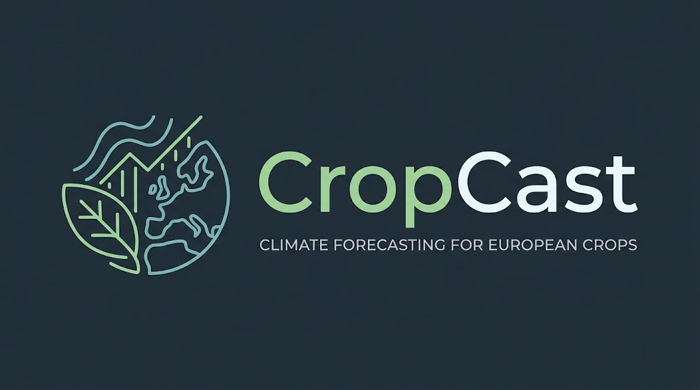

<b><a href="https://cropcast-5rcn.onrender.com/app/">Open the live platform</a></b> · <a href="https://cropcast-5rcn.onrender.com/methodology.html">Methodology &amp; Limitations</a>

# CropCast

CropCast translates climate data into **crop-specific risk**. Pick a place in Europe and a crop, and see how suitable that location is today and how it is expected to change by **2030, 2040 and 2050**.

> **Decision-support tool, not an agronomic recommendation.** Climate projections are uncertain and the platform can make mistakes. Consult a local agronomist.

## The problem
Climate change is shifting where crops can grow well. Farmers, agronomists, students, policy analysts and agri-businesses need place-specific answers, not continental averages.

## What it does
- Interactive map and place search across Europe
- Suitability score (0–100%) per period, shown as a range (optimistic / medium / pessimistic)
- Risk indicators: extreme heat days, late frost, water deficit and excess rainfall
- "Today vs. 2050" comparison and a plain-language conclusion
- Starting crops: vine, olive, wheat, maize

## How it works
Daily temperature and precipitation projections (CMIP6 models, via Open-Meteo) are compared against documented agronomic thresholds for each crop. The platform counts how often each threshold is exceeded per period and converts that into risk levels and a score. No machine learning is used, so results are traceable.

## Screenshots
<!-- Add after deployment:  -->

## Roadmap
Soil summary (SoilGrids), monthly planting calendar, more crops, true SSP scenarios, full European coverage, Brazil.

## Data and licenses
Open-Meteo (attribution required), OpenStreetMap contributors (ODbL). More sources are planned (Copernicus, E-OBS, NASA POWER, WorldClim, CHELSA, SoilGrids, FAO EcoCrop). Each license will be checked and cited.

*The source code is private.*
